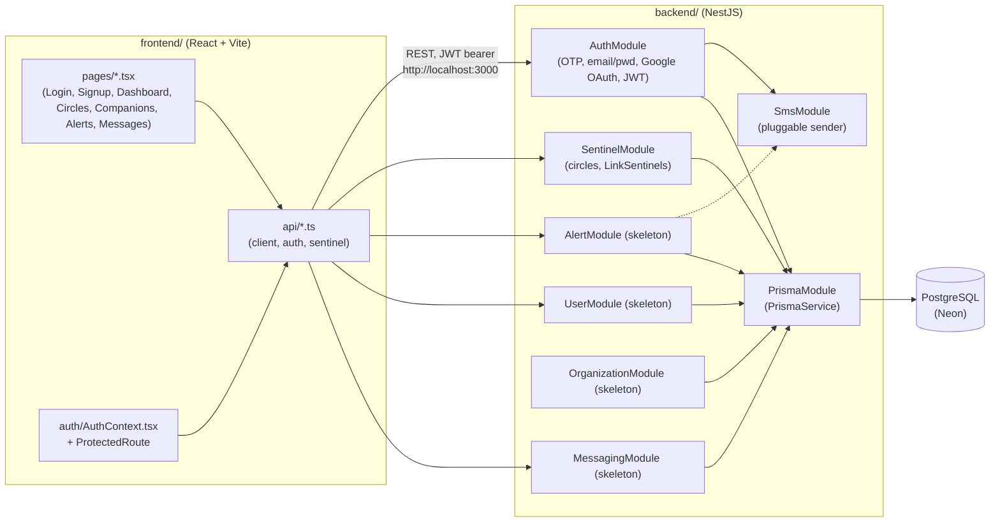

# Stack schema

Conceptual overview of the whole MySentinelCircle stack — how the pieces fit together. For DB entities/relations see `backend/prisma/DB_schema.md`; for route-by-route detail see `API.md`.

## Tech stack

- **Backend**: NestJS + TypeScript
- **Frontend web**: React + TypeScript (Vite), i18next for translations
- **Mobile**: React Native (planned, not started)
- **ORM / DB**: Prisma + PostgreSQL, hosted on Neon
- **SMS**: pluggable provider behind an interface (console sender in dev; Twilio likely default in prod)
- **Infra**: no Docker/Nginx for now — services run directly in dev

## High-level diagram

## Backend modules

One NestJS module per concern (`backend/src/`), per `plan.txt`'s BACKEND MODULES section:

| Module | Role | Status |
|---|---|---|
| `auth` | Login/signup: phone+OTP, email+password, Google OAuth; issues JWT sessions. Kept separate from `user` so auth strategies evolve independently of profile data. | Implemented (controller, service, JWT strategy/guard, OTP sender interface) |
| `user` | Create/modify account info; read own data incl. alert history; accept/decline incoming Sentinel invitations. | Skeleton |
| `sentinel` | Register Sentinels (invite or request), define circles, per-Sentinel settings (`sentinelType`, reference/responsible flag for 1st circle). Keeps the default 1st circle with ≥1 reference Sentinel. | Implemented (controller, service, SMS-based sub-controller) |
| `alert` | Send alerts (app + SMS), respond to an alert, notify relevant circles, notify everyone once closed. Only 1st circle members or "Me" can close it. | Skeleton |
| `organization` | Authenticate the `OrganizationMember`, look up a target user by phone, raise an alert (with reason), notify the 1st circle, open the Organization↔1st-circle `Conversation`. | Skeleton |
| `messaging` | Everyday Me↔Sentinel conversations outside any active alert; also backs in-alert conversations used by `alert` (1st circle chat, per-Sentinel+ isolated chat, Organization chat). Same model, different rules depending on context. | Skeleton |
| `sms` | Pluggable SMS sender behind `sms-sender.interface.ts` (console sender in dev). Used by `auth` (OTP) and will be used by `alert`. | Implemented |
| `prisma` | Wraps `PrismaService` for DB access, injected into every module above. | Implemented |

Skeleton = empty controller/service, module wired into `app.module.ts` but no logic yet — the schema (`schema.prisma`) was reworked ahead of these.

## Frontend structure

- `pages/` — one component per route: `LoginPage`, `SignupPage`, `OtpVerifyPage`, `DashboardPage`, `CirclesPage`, `CompanionsPage`, `AlertsPage`, `MessagesPage`.
- `auth/AuthContext.tsx` + `ProtectedRoute.tsx` — holds the JWT/session, gates routes.
- `api/client.ts` — thin `fetch` wrapper (`apiGet/Post/Patch/Delete`), attaches `Authorization: Bearer <token>` from `localStorage`, throws `ApiError` on non-2xx. `api/auth.ts` and `api/sentinel.ts` layer typed calls on top, one file per backend module consumed so far.
- `components/` — shared UI (`AppShell`, `LanguageSwitcher`).
- `i18n/` — i18next setup + `locales/`.

## How frontend and backend connect

- Frontend calls the backend over REST at `VITE_API_URL` (defaults to `http://localhost:3000`); backend CORS is locked to `FRONTEND_URL` (defaults to `http://localhost:5173`).
- Auth: OTP/email/Google flows hit `auth` endpoints, get back a JWT, stored in `localStorage` and attached as a bearer token on every subsequent call; `JwtAuthGuard` + `JwtStrategy` protect routes backend-side, `ProtectedRoute` gates pages frontend-side.
- Each backend module a page needs gets its own `api/<module>.ts` file frontend-side — `api/sentinel.ts` exists because `CirclesPage`/`CompanionsPage` need it; `api/alert.ts`, `api/user.ts`, `api/messaging.ts` will follow once those backend modules stop being skeletons.
- All modules share one `PrismaService` → one PostgreSQL DB on Neon; no service-to-service DB split.

## Regenerating this file

Run `/docu stack`. Keep it conceptual — update `API.md` (`/docu api`) for endpoint-level detail and `backend/prisma/DB_schema.md` (`/docu prisma`) for entity/relation detail.
