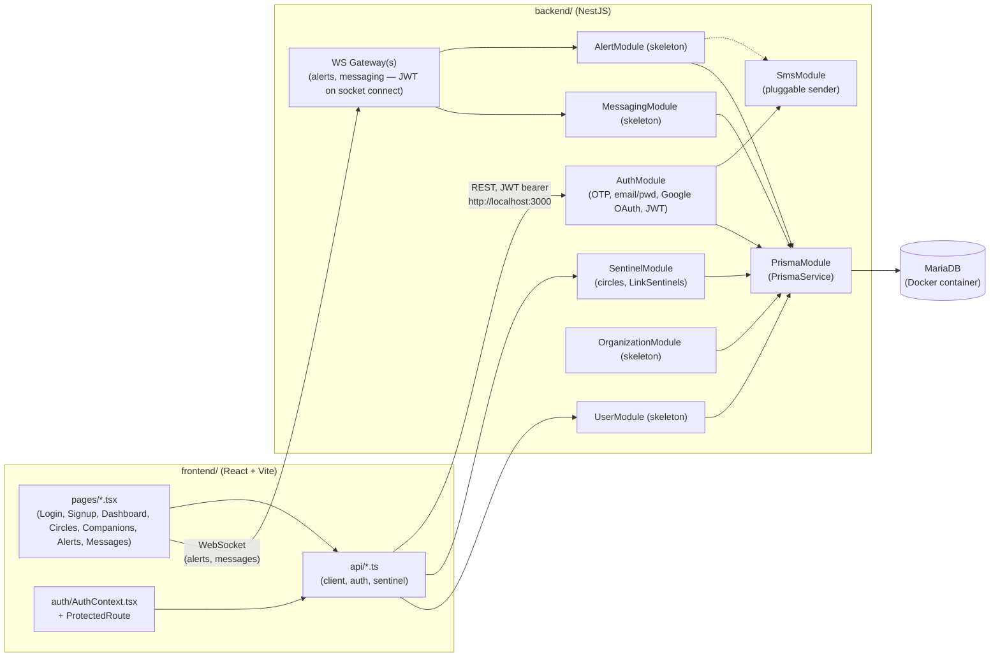

# Stack schema

Updated: 2026-08-21 16:21

Conceptual overview of the whole MySentinelCircle stack — how the pieces fit together. For DB entities/relations see `backend/prisma/DB_schema.md`; for route-by-route detail see `API.md`.

domain name: mysentinelscircles.com.

## Tech stack

- **Backend**: NestJS + TypeScript
- **Frontend web**: React + TypeScript (Vite), i18next for translations
- **Mobile**: React Native (planned, not started)
- **ORM / DB**: Prisma + MariaDB, containerized (self-hosted, not a managed provider like Neon)
- **SMS**: pluggable provider behind an interface (console sender in dev; Twilio likely default in prod)
- **Real-time**: hybrid REST + WebSocket. WebSocket (NestJS gateway) for alerts, notifications, and messages — everything else stays REST. One WS gateway with rooms keyed by `conversationId`, reusing the single `Conversation`/`Message` model; alerts fan out to WS (connected users) and SMS (everyone else) in parallel. WS auth reuses the existing JWT, verified on socket connection.
- **Rate limiting**: `@nestjs/throttler`. Pattern: `@UseGuards(RateLimitGuard, AuthGuard)` + `@Throttle({ default: { limit, ttl } })` per controller, custom Swagger decorators kept in a separate `*.documentation.ts` file. Priority targets: OTP and alert routes. **Not implemented yet** — `@nestjs/throttler` isn't installed, `RateLimitGuard` doesn't exist. The `trust proxy` half below is done; this half is still to do.
  Lesson from transcendance: behind nginx, the backend saw every client as the same IP, so concurrent signups all shared one throttle bucket and got blocked. Fix: nginx must set `X-Forwarded-For`/`X-Real-IP` (done, every `nginx/nginx.conf` location block sets it), NestJS must `app.set('trust proxy', 1)` (done, in `main.ts`), and OTP/signup throttling must key on the target identifier (phone/account), not IP alone — several real users can legitimately share one IP (school network, hotel Organization Sentinels).
- **Infra**: Docker + `docker-compose` (pattern reused from the transcendance project, adapted — see `PERMISSIONSCLAUDE.md`, these files are now `deny`-locked). Root `docker-compose.yml` runs 4 services: `mariadb` (named volume, persists across restarts), `backend`, `frontend`, `nginx` (reverse proxy, self-signed HTTPS). Two ways to run locally:
  - **Host mode** (`make dev`): backend on `:3000`, frontend on `:5173`, both on the bare host — the original simple flow, still works unchanged.
  - **Docker mode** (`make docker-up`, after `make certs` once): full stack in containers, reachable through nginx at `https://localhost:4444` (HTTP `:8081` redirects to it). `backend`/`frontend` containers publish no ports — only reachable via nginx — so both modes can run at once without colliding, sharing only the `mariadb` container/volume. nginx routes one location block per backend module prefix (`/auth/`, `/user/`, `/sentinel/`, `/alert/`, `/organization/`, `/messaging/`, plus a forward-looking `/socket.io/`) straight through to `backend:3000`, no `/api` prefix. The frontend's `VITE_API_URL` is overridden to `""` in Docker mode so every API call becomes same-origin relative through nginx — no frontend code change needed. Cert is self-signed (`make certs`, gitignored) — browsers show a "not private" warning, expected until a real domain is involved.
- **Hosting**: 42 Lausanne VM (`vod.42lausanne.ch`) for first tests with real users; planned migration to Infomaniak (Node.js hosting) for the stable public launch — same containerized MariaDB carries over unchanged, Infomaniak includes MariaDB free in that plan.

## High-level diagram

## Backend modules

One NestJS module per concern (`backend/src/`), per `plan.txt`'s BACKEND MODULES section:

| Module | Role | Status |
|---|---|---|
| `auth` | Login/signup: phone+OTP, email+password, Google OAuth; issues JWT sessions. Kept separate from `user` so auth strategies evolve independently of profile data. | Implemented (controller, service, JWT strategy/guard, OTP sender interface) |
| `user` | Create/modify account info; read own data incl. alert history; accept/decline incoming Sentinel invitations. | Skeleton |
| `sentinel` | Register Sentinels (invite or request), define circles, per-Sentinel settings (`sentinelType`, reference/responsible flag for 1st circle). Keeps the default 1st circle with ≥1 reference Sentinel. | Implemented (controller, service, SMS-based sub-controller) |
| `alert` | Send alerts (app WS + SMS), respond to an alert, notify relevant circles, notify everyone once closed. Only 1st circle members or "Me" can close it. Real-time updates over WS; everything else (history, etc.) over REST. | Skeleton |
| `organization` | Authenticate the `OrganizationMember`, look up a target user by phone, raise an alert (with reason), notify the 1st circle, open the Organization↔1st-circle `Conversation`. | Skeleton |
| `messaging` | Everyday Me↔Sentinel conversations outside any active alert; also backs in-alert conversations used by `alert` (1st circle chat, per-Sentinel+ isolated chat, Organization chat). Same model, different rules depending on context. Message delivery over WS (room per `conversationId`); conversation/history CRUD over REST. | Skeleton |
| `sms` | Pluggable SMS sender behind `sms-sender.interface.ts` (console sender in dev). Used by `auth` (OTP) and will be used by `alert`. | Implemented |
| `prisma` | Wraps `PrismaService` for DB access, injected into every module above. | Implemented |

Skeleton = empty controller/service, module wired into `app.module.ts` but no logic yet — the schema (`schema.prisma`) was reworked ahead of these.

## Frontend structure

- `pages/` — one component per route: `LoginPage`, `SignupPage`, `OtpVerifyPage`, `DashboardPage`, `CirclesPage`, `CompanionsPage`, `AlertsPage`, `MessagesPage`.
- `auth/AuthContext.tsx` + `ProtectedRoute.tsx` — holds the JWT/session, gates routes.
- `api/client.ts` — thin `fetch` wrapper (`apiGet/Post/Patch/Delete`), attaches `Authorization: Bearer <token>` from `localStorage`, throws `ApiError` on non-2xx. `api/auth.ts` and `api/sentinel.ts` layer typed calls on top, one file per backend module consumed so far.
- `components/` — shared UI (`AppShell`, `LanguageSwitcher`).
- `i18n/` — i18next setup + `locales/`.

## How frontend and backend connect

- Frontend calls the backend over REST at `VITE_API_URL` (defaults to `http://localhost:3000` in host mode; overridden to `""` in Docker mode so calls are same-origin through nginx). Backend CORS is locked to `FRONTEND_URL` (defaults to `http://localhost:5173`; only exercised in host mode — same-origin requests through nginx don't trigger CORS at all).
- Auth: OTP/email/Google flows hit `auth` endpoints, get back a JWT, stored in `localStorage` and attached as a bearer token on every subsequent call; `JwtAuthGuard` + `JwtStrategy` protect routes backend-side, `ProtectedRoute` gates pages frontend-side.
- Real-time: alerts, notifications, and messages go over WebSocket instead of REST — the same JWT is reused to authenticate the socket on connect. Everything outside an active alert (except messages) stays REST. Rooms are keyed by `conversationId`, so one gateway serves every conversation context (1:1 companion↔sentinel, 1st-circle group, per-alert isolated chat, organization chat).
- Each backend module a page needs gets its own `api/<module>.ts` file frontend-side — `api/sentinel.ts` exists because `CirclesPage`/`CompanionsPage` need it; `api/alert.ts`, `api/user.ts`, `api/messaging.ts` will follow once those backend modules stop being skeletons.
- All modules share one `PrismaService` → one MariaDB DB, containerized alongside backend/frontend/nginx via `docker-compose`; no service-to-service DB split.

## Regenerating this file

Run `/docu stack`. Keep it conceptual — update `API.md` (`/docu api`) for endpoint-level detail and `backend/prisma/DB_schema.md` (`/docu prisma`) for entity/relation detail.
