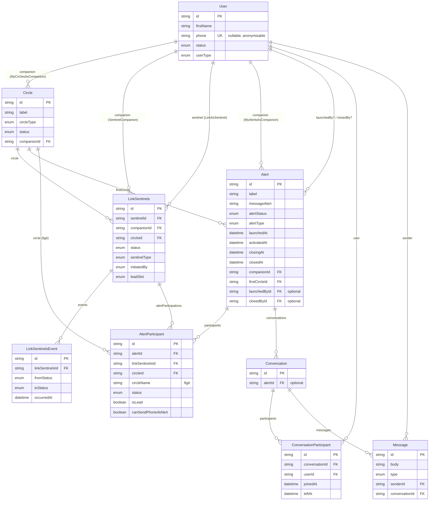
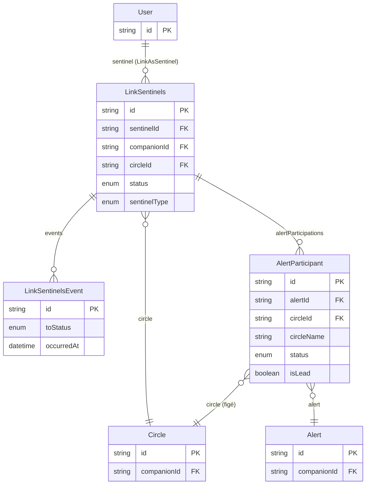
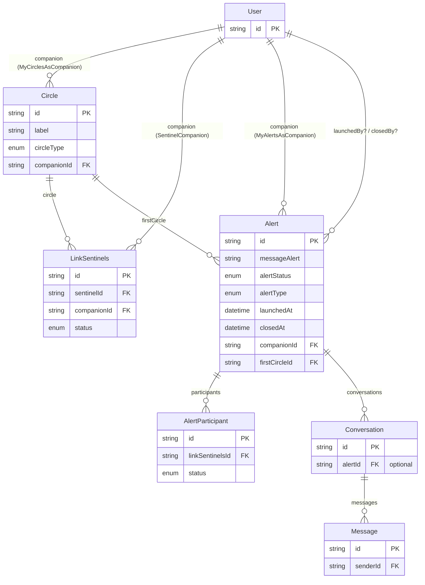
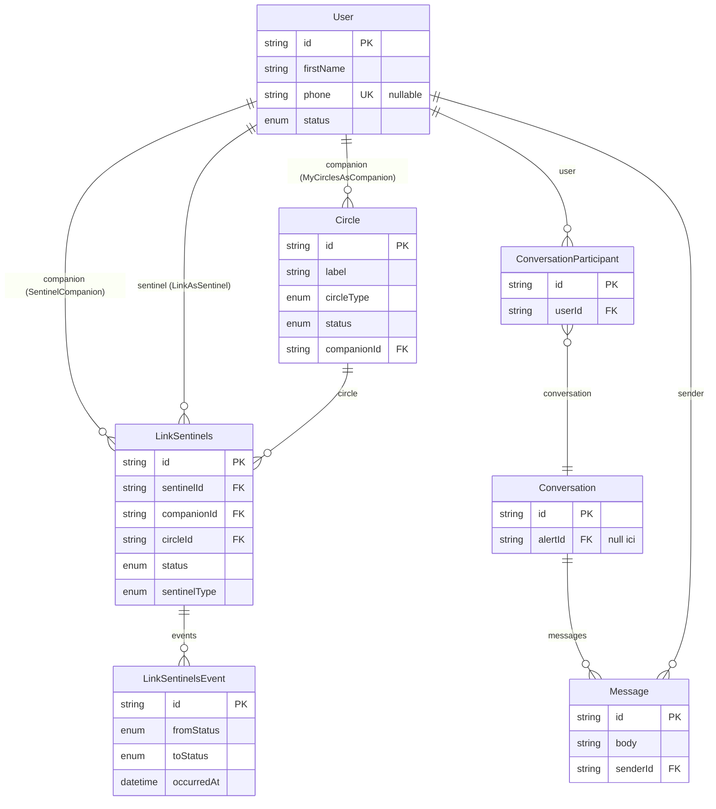
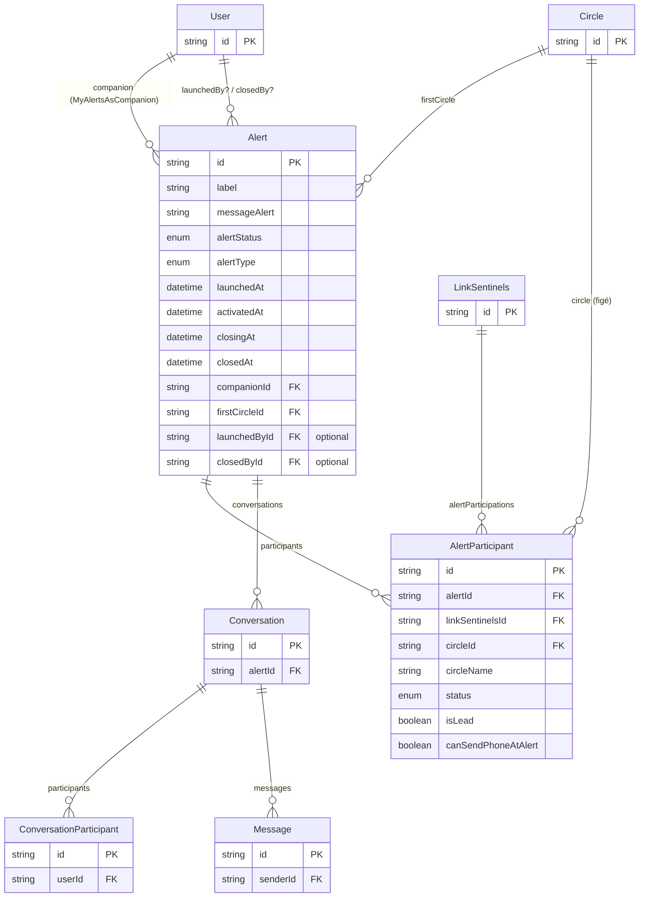

## Database Schema

> Reflète l'état actuel de `schema.prisma` (branche `data_base_definition`).

Modèles actifs : `User`, `Circle`, `LinkSentinels`, `LinkSentinelsEvent`, `Alert`, `AlertParticipant`, `Conversation`, `ConversationParticipant`, `Message`.
Principe central : rien n'est jamais vraiment supprimé — `User`/`Circle`/`LinkSentinels` se ferment ou s'anonymisent, mais restent référençables pour toujours. Pas de tables-copies (`CircleAlert`/`LinkSentinelAlert` n'existent plus), pas de journal d'événements séparé (`AlertEvent` a été remplacé par des timestamps d'étape directement sur `Alert`).

---

## Vue "Sentinel"

Ce que `User` touche quand il agit **comme sentinelle**.

- `LinkAsSentinel` : les cercles où ce `User` est enregistré comme sentinelle.
- `alertParticipations` : l'historique de toutes les alertes où ce `User` a été sollicité — via son `LinkSentinels`, sans copier son identité. `circleId`/`circleName` figent le cercle tel qu'il était à ce moment, car `LinkSentinels.circleId` peut changer après coup.

## Vue "Companion"

Ce que `User` touche quand il agit **comme companion**.

- `MyCirclesAsCompanion` : les cercles que ce `User` possède.
- `MyAlertsAsCompanion` : les alertes que ce `User` a déclenchées.
- `firstCircle` sur `Alert` pointe directement sur `Circle` (permanent) — plus besoin de snapshot.
- `Alert.launchedBy`/`closedBy` pointent directement sur `User` — couvre aussi bien le cas où c'est le companion lui-même (`AlertType.BYCOMPANION`) que le cas où c'est une sentinelle.

---

## Schéma "avant alerte"

Le monde vivant : cercles, liens sentinelles (jamais fermés/recréés, juste transitionnés), leur journal minimal, et la messagerie 1:1 permanente.

Chaque transition de statut (`PENDING→ACCEPTED`, `ACCEPTED→REMOVED`...) crée une ligne `LinkSentinelsEvent` — seule trace d'historique hors alerte, et elle sert aussi de déclencheur de notification ("Anna a quitté ton 1er cercle"). Une conversation hors alerte a `alertId = null` ; on la retrouve en cherchant, via `ConversationParticipant`, une conversation sans alerte partagée par exactement ces 2 users.

## Schéma "pendant alerte"

Ce qui se déclenche une fois une alerte lancée : qui a participé (référence directe au lien permanent, pas de copie), les étapes franchies, et les conversations scopées à l'alerte.

`AlertParticipant.linkSentinelsId` est obligatoire — il pointe toujours sur le lien vivant, jamais une copie. Le cas "companion s'auto-alerte" (`AlertType.BYCOMPANION`) n'a pas besoin de `AlertParticipant` : `Alert.launchedBy` pointe directement sur `User`. Les 3 "genres" de conversation pendant une alerte (groupe du 1er cercle, 1er cercle ↔ un autre cercle, 1er cercle ↔ une sentinelle) ne sont plus typés en DB — ils se distinguent uniquement par leurs `ConversationParticipant`, une question de logique backend, pas de schéma.

---

## Légende — les différents mécanismes d'historique

- **`LinkSentinels`** : lien vivant User↔Circle, une seule ligne par paire, jamais supprimée — juste son `status` change (`PENDING`/`ACCEPTED`/`REMOVED`/`BLOCKED`...).
- **`LinkSentinelsEvent`** : journal append-only de chaque transition de statut — trace minimale de qui est entré/sorti d'un cercle, indépendamment de toute alerte.
- **`AlertParticipant`** : ce qui s'est passé pour un `LinkSentinels` donné pendant une alerte donnée (contacté, répondu, lead, réglages de messagerie au moment T, cercle figé via `circleId`/`circleName`) — remplace l'ancien `LinkSentinelAlert`, sans jamais copier l'identité (nom/téléphone restent uniquement dans `User`).
- **Étapes de l'alerte** : `Alert.launchedAt`/`activatedAt`/`closingAt`/`closedAt` — un timestamp par étape franchie, directement sur `Alert` (pas de table d'événements séparée ; ne garde que le dernier passage si une étape est revisitée).
- **`Conversation` / `ConversationParticipant` / `Message`** : fil générique, réutilisable pour n'importe quel groupe de `User` à n'importe quel moment. `alertId` (optionnel) dit juste si elle est scopée à une alerte ou pas — le "genre" de conversation (1:1 permanent, groupe 1er cercle, cercle à cercle, sentinelle isolée) n'est pas stocké : il se déduit des participants, côté backend.

Anonymisation : quand un `User` supprime son compte, `status → DELETED` + ses champs identifiants sont vidés/anonymisés, mais son `id` reste — `Message.senderId`, `AlertParticipant`, `ConversationParticipant` continuent de fonctionner sans casser l'historique.
