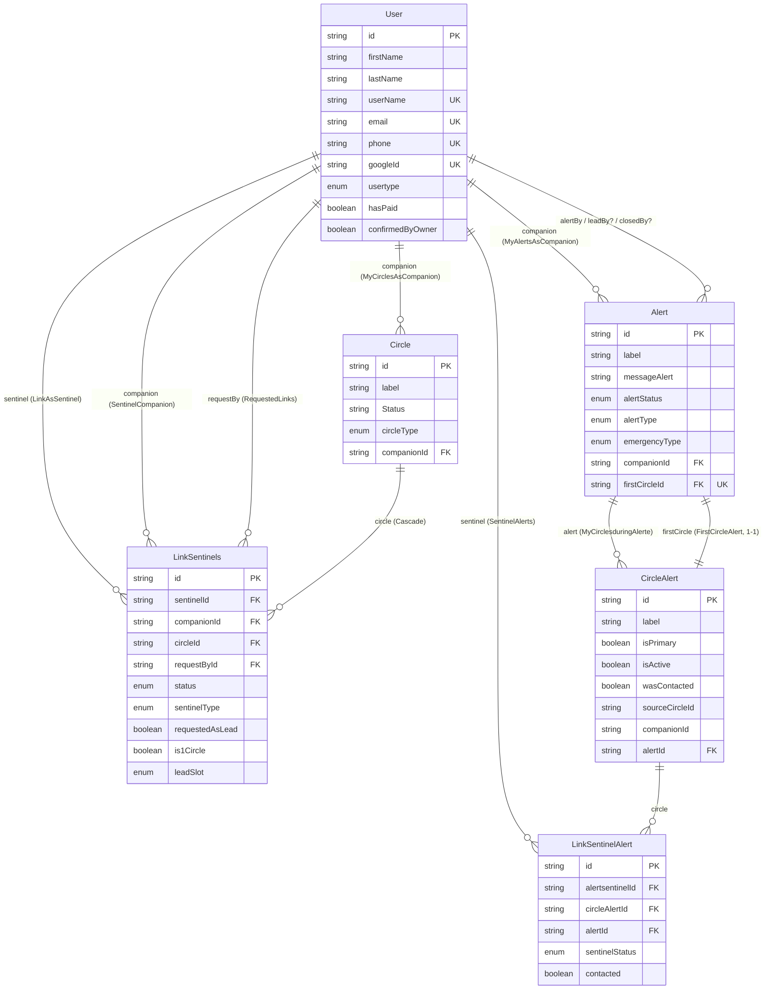
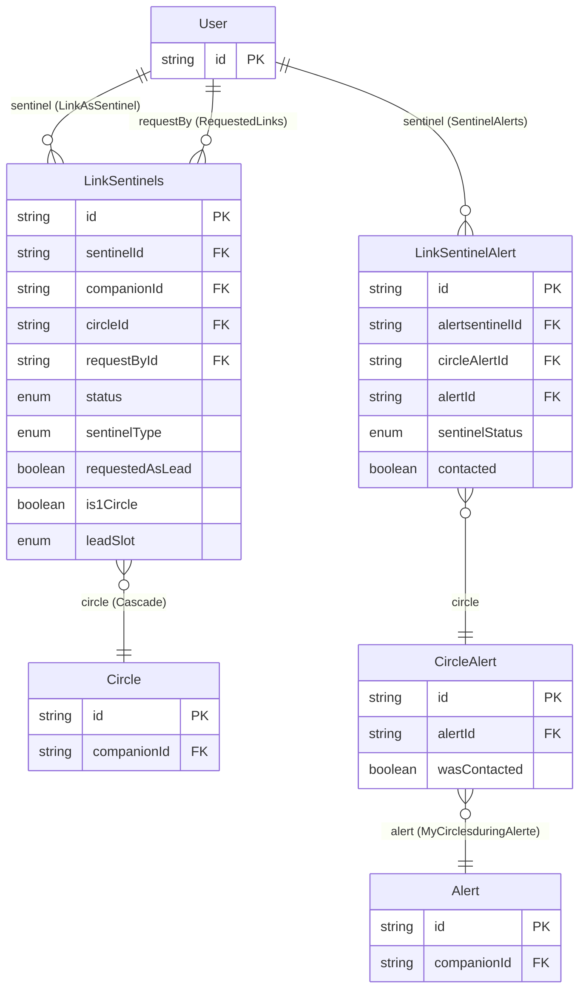
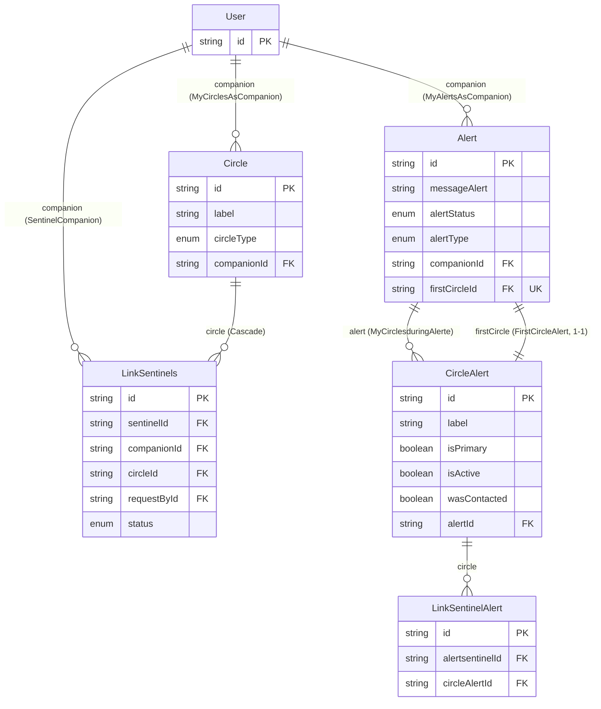

## Database Schema

> Reflète l'état actuel de `schema.prisma` (branche `data_base_definition`).

Modèles actifs : `User`, `Circle`, `Alert`, `LinkSentinels`, `CircleAlert`, `LinkSentinelAlert`.
Tout le reste (Organization, Message, AlertChat...) est encore en commentaire dans le fichier, pas dans le DB.

**Changements depuis la dernière version de ce doc** :
- `Alert.firstCircleId` n'est plus un `String` orphelin : c'est maintenant une vraie relation 1-1 vers `CircleAlert` (`firstCircleId @unique` + `firstCircle`/`FirstCircle`).
- Typos corrigées : `AlertStatus.LAUCHED` → `LAUNCHED`, `UserType.ORGANISATON` → `ORGANISATION`, `LinkStatus.BLOQUED` → `BLOCKED`.
- Tous les `updatedAt` sont redevenus non-nullables (cohérent avec `@updatedAt`).
- `User.phone` est maintenant requis + `@unique` (plus nullable) ; `LinkSentinelAlert.email` est maintenant optionnel — les deux sont désormais cohérents avec ce qu'ils copient/reflètent.
- `CircleType` a perdu `EMPTY`/`CLOSED` : ces états sont gérés via `Circle.closedAt` (fermé) et un filtre de requête sur les `sentinelLinks` actifs (vide), pas stockés dans le type.
- `LinkSentinels.circle` porte désormais `onDelete: Cascade` — c'est la **seule** action de suppression explicite de tout le schéma.

---

## Vue "Sentinel"

Ce que `User` touche quand il agit **comme sentinelle** (surveillé/protégé par personne, mais protège/veille sur d'autres) : ses liens vers des cercles qu'il ne possède pas, et son historique dans les alertes des autres.

- `LinkAsSentinel` : les cercles où ce `User` est enregistré comme sentinelle (`LinkSentinels.sentinelId`).
- `RequestedLinks` : les demandes de lien que ce `User` a lui-même initiées (`LinkSentinels.requestById`) — possible même en tant que sentinelle, si c'est elle qui demande à rejoindre un cercle.
- `SentinelAlerts` : l'historique figé (`LinkSentinelAlert`) de toutes les alertes où ce `User` a été sollicité comme sentinelle. Pour remonter jusqu'à l'`Alert`, il faut passer par `CircleAlert` (deux sauts).

## Vue "Companion"

Ce que `User` touche quand il agit **comme companion** (celui qui est protégé, propriétaire de ses cercles et de ses alertes).

- `MyCirclesAsCompanion` : les cercles que ce `User` possède (`Circle.companionId`).
- `MyAlertsAsCompanion` : les alertes que ce `User` a déclenchées (`Alert.companionId`).
- Chaque `Circle` possédé expose ses `sentinelLinks` — qui a été invité/accepté dedans, avec quel statut.
- Chaque `Alert` déclenchée expose ses `Mycircles: CircleAlert[]` — la photo figée de tous les cercles au moment du déclenchement, plus `firstCircle: CircleAlert` — celui d'entre eux désigné comme premier cercle sollicité. Chaque `CircleAlert` expose à son tour ses `sentinels: LinkSentinelAlert[]`.

---

## Les liens, un par un

| Relation Prisma | Depuis → Vers | Cardinalité | Champ(s) FK | `onDelete` | Unique ? |
|---|---|---|---|---|---|
| `MyCirclesAsCompanion` | `User` → `Circle` | 1-N | `Circle.companionId` | non précisé (défaut Restrict) | — |
| `MyAlertsAsCompanion` | `User` → `Alert` | 1-N | `Alert.companionId` | non précisé (défaut Restrict) | — |
| `SentinelCompanion` | `User` → `LinkSentinels` | 1-N | `LinkSentinels.companionId` | non précisé (défaut Restrict) | — |
| `LinkAsSentinel` | `User` → `LinkSentinels` | 1-N | `LinkSentinels.sentinelId` | non précisé (défaut Restrict) | — |
| `RequestedLinks` | `User` → `LinkSentinels` | 1-N | `LinkSentinels.requestById` | non précisé (défaut Restrict) | — |
| `alertBy` | `User` → `Alert` | 1-N | `Alert.alertById` | non précisé (défaut Restrict) | — |
| `leadBy` | `User` → `Alert` | 1-N, FK optionnelle | `Alert.leadById?` | non précisé (défaut SetNull) | — |
| `closedBy` | `User` → `Alert` | 1-N, FK optionnelle | `Alert.closedById?` | non précisé (défaut SetNull) | — |
| *(implicite)* | `Circle` → `LinkSentinels` | 1-N, FK composite `[circleId, companionId]` → `[id, companionId]` | `LinkSentinels.circleId`+`companionId` | **`Cascade`** (explicite) | — |
| `FirstCircleAlert` | `CircleAlert` → `Alert` | **1-1** | `Alert.firstCircleId` | non précisé (défaut Restrict) | `@unique` sur `firstCircleId` |
| `MyCirclesduringAlerte` | `Alert` → `CircleAlert` | 1-N | `CircleAlert.alertId` | non précisé (défaut Restrict) | — |
| `SentinelAlerts` | `User` → `LinkSentinelAlert` | 1-N | `LinkSentinelAlert.alertsentinelId` | non précisé (défaut Restrict) | — |
| *(implicite)* | `CircleAlert` → `LinkSentinelAlert` | 1-N, FK composite `[circleAlertId, alertId]` → `[id, alertId]` | `LinkSentinelAlert.circleAlertId`+`alertId` | non précisé (défaut Restrict) | — |

Deux FK composites méritent d'être notées à part : `LinkSentinels.circle` et `LinkSentinelAlert.circle` ne référencent pas juste un `id`, mais aussi le `companionId`/`alertId` du parent — ça force en base que le lien pointe forcément vers un cercle (ou circle-snapshot) qui appartient bien au même companion/alerte, pas à un autre par erreur.

`Alert.firstCircle`, elle, référence seulement `CircleAlert.id` (pas de FK composite) : rien n'empêche en base qu'un `firstCircleId` pointe vers un `CircleAlert` d'une **autre** alerte. Pour avoir la même garantie que les deux relations composites ci-dessus, il faudrait `@relation(fields: [firstCircleId, id], references: [id, alertId])` en s'appuyant sur `CircleAlert.@@unique([id, alertId])` (déjà présent). Pas fait pour l'instant.

Contraintes d'unicité actives dans le schéma :
- `LinkSentinels.@@unique([sentinelId, companionId])` — un sentinel n'a qu'un seul lien vivant par companion (donc un seul cercle possible chez ce companion).
- `LinkSentinels.@@unique([circleId, leadSlot])` — un `LEAD_1`/`LEAD_2`/`LEAD_3` ne peut être occupé qu'une fois par cercle.
- `Circle.@@unique([id, companionId])` — sert de cible à la FK composite de `LinkSentinels.circle` (pas redondante : c'est elle qui permet à Prisma d'imposer `LinkSentinels.companionId == Circle.companionId`).
- `Alert.firstCircleId @unique` — un `CircleAlert` ne peut être `firstCircle` que d'une seule `Alert`.
- `CircleAlert.@@unique([alertId, sourceCircleId])` — un cercle source n'est copié qu'une fois par alerte.
- `CircleAlert.@@unique([id, alertId])` — cible de la FK composite de `LinkSentinelAlert.circle` (même rôle que `Circle.@@unique([id, companionId])` ci-dessus).
- `LinkSentinelAlert.@@unique([alertId, alertsentinelId])` — une sentinelle n'est copiée qu'une fois par alerte.

### Pourquoi (en fait) quatre tables de liaison

- **`LinkSentinels`** = lien *vivant* User↔Circle. Trois FK sur `User` : `sentinelId` (qui est sentinelle), `companionId` (qui est le companion, redondant avec `circle.companionId` mais forcé identique par la FK composite), `requestById` (qui a initié l'invitation/demande — peut être le companion ou la sentinelle). Modifiable tant que le statut (`PENDING/ACCEPTED/DECLINED/REMOVED/BLOCKED`) évolue.
- **`CircleAlert`** = *copie figée* d'un `Circle` au moment où une alerte se déclenche (label, isPrimary, isActive + `wasContacted`/`contactedAt` propres à l'alerte). Une d'entre elles, par alerte, est désignée `firstCircle`.
- **`LinkSentinelAlert`** = *copie figée* d'un `LinkSentinels` au moment de l'alerte : qui était sentinelle, dans quel cercle-snapshot, avec ses infos de contact (nom, email, téléphone) copiées telles quelles. Indépendante de `LinkSentinels` pour ne jamais être faussée si le lien vivant change après coup (ex: la sentinelle quitte le cercle après l'alerte).
- Le `companion` d'une `Alert` (`Alert.companionId`) reste une FK directe, pas de table de liaison : cardinalité 1, inutile d'en faire une N-N.

Aucune relation n'est many-to-many directe dans ce schéma : `User↔Circle` passe toujours par `LinkSentinels`, `User↔Alert` (côté sentinelle) passe par deux niveaux de copie (`CircleAlert` puis `LinkSentinelAlert`), miroir exact du chemin vivant (`Circle` puis `LinkSentinels`).

---

## Détail des modèles

### User
- `id` PK
- `firstName`, `lastName?`, `userName?` UK
- `email?` UK, `phone` UK (requis), `googleId?` UK
- `passwordHash?`, `phoneVerifiedAt?`, `isMajor: Boolean` (défaut `true`), `status?`
- `usertype?: UserType` (défaut `ONLY_SMS`), `hasPaid: Boolean` (défaut `false`), `confirmedByOwner: Boolean` (défaut `false`)
- OTP : `otpCodeHash?`, `otpExpiresAt?`, `otpAttempts: Int` (défaut `0`)
- Relations sortantes : `myCircles`, `myAlertes`, `mySentinels`, `LinkAsSentinel`, `sentinelAlerts`, `alertByUser`, `leadByUser`, `closedByUser`, `requestedLinks`

### Circle
- `id` PK
- `label`, `Status?`, `circleType: CircleType` (défaut `BASIC`), `closedAt?`
- `GroupChat`, `CanSendPhone` : booléens (défaut `false`)
- `companionId` FK → `User.id`
- `sentinelLinks: LinkSentinels[]`

### Alert
- `id` PK, `closedAt?`
- `label`, `emergencyType: EmergencyType` (défaut `LITTLEWORRY`), `messageAlert`, `alertStatus: AlertStatus` (défaut `SENT`), `alertType: AlertType` (défaut `UNKNOWN`)
- `alertById`, `leadById?`, `closedById?` — 3 FK vers `User`
- `firstCircleId` FK → `CircleAlert.id`, unique (relation 1-1)
- `leadSentinel?` — string libre, sans FK, "à déterminer durant l'alerte"
- `StatusByCompanion?`, `StatusByFirstCircle?`
- `companionId` FK → `User.id`
- `Mycircles: CircleAlert[]`

### LinkSentinels
- `id` PK
- `sentinelType: SentinelType` (défaut `ONLY_SMS`), `status: LinkStatus` (défaut `PENDING`)
- `requestedAsLead: Boolean` (défaut `false`), `is1Circle: Boolean` (défaut `false`), `leadSlot?: LeadSlot`
- `GroupChat`, `Chat`, `CanSendPhone` : booléens (défaut `false`)
- `sentinelId`, `companionId`, `circleId`, `requestById` — 4 FK
- `@@unique([sentinelId, companionId])`, `@@unique([circleId, leadSlot])`

### CircleAlert
- `id` PK
- `label`, `isPrimary: Boolean` (défaut `false`), `isActive: Boolean` (défaut `false`)
- `GroupChat`, `CanSendPhone` : booléens (défaut `false`)
- `wasContacted: Boolean` (défaut `false`), `contactedAt?`
- `sourceCircleId` (indexé, snapshot sans FK), `companionId` (indexé)
- `alertId` FK → `Alert.id`
- `FirstCircle: Alert?` — côté opposé de la relation 1-1 `firstCircle`
- `sentinels: LinkSentinelAlert[]`
- `@@unique([alertId, sourceCircleId])`, `@@unique([id, alertId])`

### LinkSentinelAlert
- `id` PK, `closedAt?`
- Copié de `User` : `FirstName`, `lastName?`, `userName?`, `email?`, `phone`, `phoneVerifiedAt?`, `isMajor: Boolean` (défaut `true`), `status?`
- Copié de `LinkSentinels` : `isPending: Boolean` (défaut `true`), `sentinelType: SentinelType` (requis, pas de défaut), `is1Circle: Boolean` (requis), `leadSlot?`
- `GroupChat`, `Chat`, `CanSendPhone` : booléens (défaut `false`)
- Pendant l'alerte : `sentinelStatus: SentinelStatus` (défaut `INACTIVE`), `contacted: Boolean` (défaut `false`), `contactedAt?`, `contactedBy?`, `contactedWhy?`
- `sourceLinkSentinelsId` (indexé, snapshot sans FK)
- `alertId`, `alertsentinelId`, `circleAlertId` — dont `circleAlertId`+`alertId` forment la FK composite vers `CircleAlert`
- `@@unique([alertId, alertsentinelId])`

---

## Enums

| Enum | Valeurs | Utilisé sur |
|---|---|---|
| `UserType` | `ONLY_SMS`, `ACCOUNT`, `PAID_ACCOUNT`, `ORGANISATION`, `DEAD` | `User.usertype` |
| `LinkStatus` | `PENDING`, `ACCEPTED`, `DECLINED`, `REMOVED`, `BLOCKED` | `LinkSentinels.status` |
| `AlertStatus` | `SENT`, `LAUNCHED`, `ACTIVE`, `CLOSING`, `RESOLVED` | `Alert.alertStatus` |
| `AlertType` | `MISSING`, `INCIDENT`, `UNKNOWN` | `Alert.alertType` |
| `EmergencyType` | `LITTLEWORRY`, `ACCIDENT`, `EMERGENCY` | `Alert.emergencyType` |
| `SentinelType` | `ONLY_SMS`, `SENTINEL`, `LEAD`, `FIRSTCIRCLE`, `UNCOMPLETE` | `LinkSentinels.sentinelType`, `LinkSentinelAlert.sentinelType` |
| `SentinelStatus` | `INACTIVE`, `ACTIVE`, `CONNECTED`, `DEAD` | `LinkSentinelAlert.sentinelStatus` |
| `CircleType` | `BASIC`, `FIRST`, `ORGANISATION` | `Circle.circleType` |
| `LeadSlot` | `LEAD_1`, `LEAD_2`, `LEAD_3` | `LinkSentinels.leadSlot`, `LinkSentinelAlert.leadSlot` |

Commenté, non actif : `CircleStatus` (`ACTIVE`/`INACTIVE`/`CLOSED`) — abandonné au profit de `Circle.closedAt` + filtre de requête.

---

## Incohérences repérées

Rien de bloquant, mais plusieurs points valent une décision consciente avant de migrer :

1. **`Alert.firstCircle` n'a pas de FK composite.** Contrairement à `LinkSentinels.circle` et `LinkSentinelAlert.circle`, la relation `firstCircle` ne référence que `CircleAlert.id` — rien n'empêche en base qu'elle pointe vers un `CircleAlert` d'une autre alerte. Fix possible : `@relation(fields: [firstCircleId, id], references: [id, alertId])` en s'appuyant sur `CircleAlert.@@unique([id, alertId])`.
2. **Un seul `onDelete` explicite dans tout le schéma** (`LinkSentinels.circle` → `Cascade`). Toutes les autres FK obligatoires vers `User` (companion, alertBy, sentinel...) sont donc en comportement par défaut (Restrict) : supprimer un `User` sera bloqué tant qu'il a une seule ligne liée quelque part, dans n'importe quel modèle. À valider explicitement (probablement voulu, pour ne jamais perdre l'historique — auquel cas un soft-delete côté app plutôt qu'un vrai `DELETE` serait cohérent).
3. **Casse incohérente persiste** : `Mycircles` (Alert), `FirstCircle` (CircleAlert), `FirstName` (LinkSentinelAlert), `GroupChat`/`CanSendPhone`/`Chat` en PascalCase un peu partout vs le reste en camelCase (`hasPaid`, `sentinelId`...), `Status` (Circle) vs `status` (User, LinkSentinelAlert). Purement cosmétique mais source d'erreurs de frappe côté client Prisma généré.
4. **`LinkSentinelAlert` n'a pas d'équivalent de `requestById`.** Probablement volontaire (qui a demandé le lien n'a plus d'importance une fois l'alerte lancée) mais toujours pas confirmé explicitement.
5. **`Alert.leadSentinel`** reste un `String?` libre sans FK — cohérent avec la doctrine du projet (règles FIRST-circle/LEAD-sentinel gérées côté app, pas en contrainte DB), mais à garder en tête si un jour on veut vérifier en base que ça pointe vers un vrai `LinkSentinelAlert` de la même alerte.
6. **`CircleAlert.isActive`** est un champ récent sans commentaire — son rôle exact (actif = encore en cours de traitement pendant l'alerte ? vs `wasContacted` ?) vaut la peine d'être clarifié en commentaire dans le schéma.

## À retenir
- Le schéma est symétrique : `User(companion) → Circle → LinkSentinels → User(sentinel)` côté vivant, `Alert → CircleAlert → LinkSentinelAlert → User(sentinel)` côté figé, plus `Alert → CircleAlert` en 1-1 pour désigner le premier cercle.
- Les deux FK composites (`LinkSentinels.circle`, `LinkSentinelAlert.circle`) garantissent en base que companion/alerte du lien et du parent correspondent — un bon réflexe qui n'a pas encore été étendu à `Alert.firstCircle` (point 1 ci-dessus).
