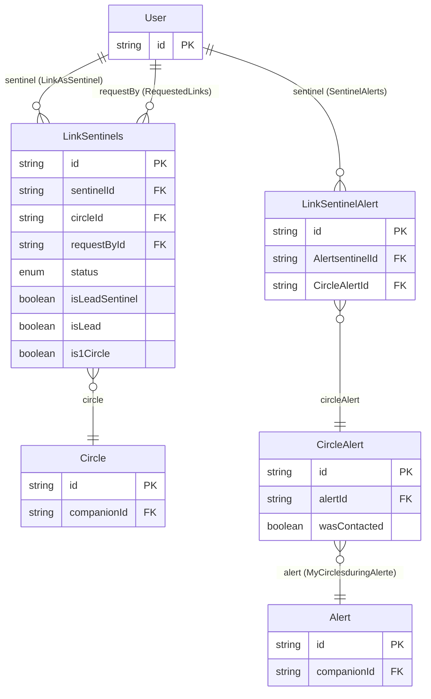
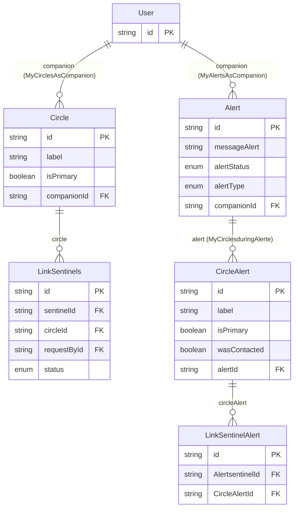

## Database Schema

> Reflète l'état actuel de `schema.prisma` (branche `data_base_definition`).

Modèles actifs : `User`, `Circle`, `Alert`, `LinkSentinels`, `CircleAlert`, `LinkSentinelAlert`.
Tout le reste (Organization, Message, AlertChat...) est encore en commentaire dans le fichier, pas dans le DB.

**Changement depuis la dernière version de ce doc** : l'ancien modèle unique `LinkAlert` (User↔Alert direct) a été remplacé par une paire `CircleAlert` + `LinkSentinelAlert`, qui recopie côté alerte exactement la même forme que `Circle` + `LinkSentinels` côté vivant : `Alert → CircleAlert → LinkSentinelAlert → User`, en parallèle de `User(companion) → Circle → LinkSentinels → User(sentinel)`.

```mermaid
erDiagram
  User        ||--o{ Circle             : "companion (MyCirclesAsCompanion)"
  User        ||--o{ Alert              : "companion (MyAlertsAsCompanion)"
  User        ||--o{ LinkSentinels      : "sentinel (LinkAsSentinel)"
  User        ||--o{ LinkSentinels      : "requestBy (RequestedLinks)"
  Circle      ||--o{ LinkSentinels      : "circle"
  User        ||--o{ LinkSentinelAlert  : "sentinel (SentinelAlerts)"
  Alert       ||--o{ CircleAlert        : "alert (MyCirclesduringAlerte)"
  CircleAlert ||--o{ LinkSentinelAlert  : "circleAlert"

  User {
    string id PK
    string firstName
    string lastName
    string userName
    string email UK
    string phone UK
    string googleId UK
    enum   usertype
    boolean hasPaid
    boolean confirmedByOwner
  }

  Circle {
    string id PK
    string label
    boolean isPrimary
    string companionId FK
  }

  Alert {
    string id PK
    string label
    string messageAlert
    enum   alertStatus
    enum   alertType
    string companionId FK
  }

  LinkSentinels {
    string id PK
    string sentinelId FK
    string circleId FK
    string requestById FK
    enum   status
    boolean isLeadSentinel
    boolean isLead
    boolean is1Circle
  }

  CircleAlert {
    string id PK
    string label
    boolean isPrimary
    boolean wasContacted
    string alertId FK
  }

  LinkSentinelAlert {
    string id PK
    string AlertsentinelId FK
    string CircleAlertId FK
  }
```

---

## Vue "Sentinel"

Ce que `User` touche quand il agit **comme sentinelle** (surveillé/protégé par personne, mais protège/veille sur d'autres) : ses liens vers des cercles qu'il ne possède pas, et son historique dans les alertes des autres.

- `LinkAsSentinel` : les cercles où ce `User` est enregistré comme sentinelle (`LinkSentinels.sentinelId`).
- `RequestedLinks` : les demandes de lien que ce `User` a lui-même initiées (`LinkSentinels.requestById`) — possible même en tant que sentinelle, si c'est elle qui demande à rejoindre un cercle.
- `SentinelAlerts` : l'historique figé (`LinkSentinelAlert`) de toutes les alertes où ce `User` a été sollicité comme sentinelle. Pour remonter jusqu'à l'`Alert`, il faut maintenant passer par `CircleAlert` (deux sauts au lieu d'un directement vers `Alert` comme avant).

## Vue "Companion"

Ce que `User` touche quand il agit **comme companion** (celui qui est protégé, propriétaire de ses cercles et de ses alertes).

- `MyCirclesAsCompanion` : les cercles que ce `User` possède (`Circle.companionId`).
- `MyAlertsAsCompanion` : les alertes que ce `User` a déclenchées (`Alert.companionId`).
- Chaque `Circle` possédé expose ses `sentinelLinks` — qui a été invité/accepté dedans, avec quel statut.
- Chaque `Alert` déclenchée expose ses `Mycircles: CircleAlert[]` — la photo figée de tous les cercles au moment du déclenchement, et chaque `CircleAlert` expose à son tour ses `sentinels: LinkSentinelAlert[]` — la photo figée des sentinelles de ce cercle-là.

---

## Les liens, un par un

| Relation Prisma | Depuis → Vers | Cardinalité | Champ FK (porte le lien) | Unique ? |
|---|---|---|---|---|
| `MyCirclesAsCompanion` | `User` → `Circle` | 1-N | `Circle.companionId` | `@@unique([companionId, id])` sur `Circle` — redondant, `id` seul suffit déjà |
| `MyAlertsAsCompanion` | `User` → `Alert` | 1-N | `Alert.companionId` | — |
| `LinkAsSentinel` | `User` → `LinkSentinels` | 1-N | `LinkSentinels.sentinelId` | — |
| `RequestedLinks` | `User` → `LinkSentinels` | 1-N | `LinkSentinels.requestById` | — |
| *(implicite, pas de nom)* | `Circle` → `LinkSentinels` | 1-N | `LinkSentinels.circleId` | — |
| `SentinelAlerts` | `User` → `LinkSentinelAlert` | 1-N | `LinkSentinelAlert.AlertsentinelId` | — |
| `MyCirclesduringAlerte` | `Alert` → `CircleAlert` | 1-N | `CircleAlert.alertId` | — |
| *(implicite, pas de nom)* | `CircleAlert` → `LinkSentinelAlert` | 1-N | `LinkSentinelAlert.CircleAlertId` | — |

Contrainte composite qui compte vraiment : **`LinkSentinels.@@unique([sentinelId, circleId])`** → un seul lien vivant par couple (sentinelle, cercle). C'est la **seule** contrainte d'unicité réellement active dans tout le schéma — voir la section "incohérences" plus bas, `LinkSentinelAlert` n'a rien d'équivalent.

### Pourquoi (en fait) quatre tables de liaison

- **`LinkSentinels`** = lien *vivant* User↔Circle. Trois FK sur `User` en tout : `sentinelId` (qui est sentinelle), `requestById` (qui a initié l'invitation/demande — peut être le companion ou la sentinelle), et indirectement `circleId` → `Circle.companionId` (qui est le companion). Modifiable tant que le statut (`PENDING/ACCEPTED/DECLINED/BLOQUED`) évolue.
- **`CircleAlert`** = *copie figée* d'un `Circle` au moment où une alerte se déclenche (label, isPrimary + `wasContacted`/`contactedAt` propres à l'alerte).
- **`LinkSentinelAlert`** = *copie figée* d'un `LinkSentinels` au moment de l'alerte : qui était sentinelle, dans quel cercle-snapshot. Indépendante de `LinkSentinels` pour ne jamais être faussée si le lien vivant change après coup (ex: la sentinelle quitte le cercle après l'alerte).
- Le `companion` d'une `Alert` (`Alert.companionId`) reste une FK directe, pas de table de liaison : cardinalité 1, inutile d'en faire une N-N.

Aucune relation n'est many-to-many directe dans ce schéma : `User↔Circle` passe toujours par `LinkSentinels`, `User↔Alert` (côté sentinelle) passe maintenant par deux niveaux de copie (`CircleAlert` puis `LinkSentinelAlert`), miroir exact du chemin vivant (`Circle` puis `LinkSentinels`).

---

## Détail des modèles

### User
- `id` PK
- `firstName`, `lastName?`, `userName?`
- `email?` UK, `phone?` UK, `googleId?` UK — tous optionnels mais uniques si présents
- `passwordHash?`, `phoneVerifiedAt?`
- `usertype?: UserType` (défaut `ONLY_SMS`), `hasPaid: Boolean` (défaut `false`), `confirmedByOwner: Boolean` (défaut `false`)
- OTP : `otpCodeHash?`, `otpExpiresAt?`, `otpAttempts: Int` (défaut `0`)
- Relations sortantes : `myCircles`, `myAlertes`, `LinkAsSentinel`, `sentinelAlerts`, `requestedLinks`

### Circle
- `id` PK
- `label`, `isPrimary: Boolean` (défaut `false`)
- `companionId` FK → `User.id`
- `sentinelLinks: LinkSentinels[]`

### Alert
- `id` PK
- `closedAT?` (voir remarque casse plus bas)
- `label`, `messageAlert`, `alertStatus: AlertStatus`, `alertType: AlertType`
- `companionId` FK → `User.id`
- `Mycircles: CircleAlert[]`

### LinkSentinels
- `id` PK
- `sentinelId`, `circleId`, `requestById` — 3 FK
- `status: LinkStatus` (défaut `PENDING`), `isLeadSentinel`, `isLead`, `is1Circle` : booléens
- `@@unique([sentinelId, circleId])`

### CircleAlert
- `id` PK (pas de `createdAt` — commenté "créé durant l'alerte")
- `label`, `isPrimary: Boolean` (défaut `false`)
- `wasContacted: Boolean` (défaut `false`), `contactedAt?`
- `alertId` FK → `Alert.id`
- `sentinels: LinkSentinelAlert[]`

### LinkSentinelAlert
- `id` PK (pas de `createdAt` — commenté "créé durant l'alerte")
- `AlertsentinelId` FK → `User.id`, `CircleAlertId` FK → `CircleAlert.id`
- Aucune donnée métier copiée pour l'instant (le bloc `/* data to copy */` en commentaire liste ce qui manque encore : nom/numéro de la sentinelle, était-elle lead, a-t-elle été sollicitée, quand, réponse...)

---

## Enums

| Enum | Valeurs | Utilisé sur |
|---|---|---|
| `UserType` | `ONLY_SMS`, `ACCOUNT`, `PAID_ACCOUNT`, `ORGANISATON` | `User.usertype` |
| `LinkStatus` | `PENDING`, `ACCEPTED`, `DECLINED`, `BLOQUED` | `LinkSentinels.status` |
| `AlertStatus` | `SENT`, `LAUCHED`, `ACTIVE`, `CLOSING`, `RESOLVED` | `Alert.alertStatus` |
| `AlertType` | `MISSING`, `INCIDENT` | `Alert.alertType` |
| `SentinelType` | `ONLY_SMS`, `SENTINEL`, `LEAD`, `FIRSTCIRCLE` | déclaré, **pas encore utilisé** dans un modèle actif |
| `CircleType` | `BASIC`, `FIRST`, `ORGANISATION` | déclaré, **pas encore utilisé** dans un modèle actif |

---

## Incohérences repérées

Rien de bloquant, mais plusieurs points valent une décision consciente avant de migrer :

1. **`LinkSentinelAlert` n'a aucune contrainte d'unicité active.** L'ancienne `@@unique` est commentée et référence en plus un champ mort (`alerteId`, qui n'existe plus — les vrais champs sont `AlertsentinelId`/`CircleAlertId`). Résultat : rien n'empêche aujourd'hui plusieurs lignes pour le même couple (sentinelle, `CircleAlert`), alors que le lien vivant équivalent `LinkSentinels` est protégé par `@@unique([sentinelId, circleId])`.
2. **Aucune traçabilité entre une copie et sa source.** `CircleAlert` ne porte aucune FK vers le `Circle` dont il est la copie (seulement `alertId`), et `LinkSentinelAlert` ne porte aucune référence vers le `LinkSentinels` copié (seulement `AlertsentinelId`/`CircleAlertId`). Une fois le lien vivant modifié ou supprimé, impossible de relier formellement un snapshot à son origine autrement qu'en comparant `label`/`sentinelId` à la main. Un simple champ `sourceCircleId`/`sourceLinkId` (string, sans contrainte FK, pour ne pas casser l'indépendance voulue du snapshot) réglerait ça.
3. **Pas de `createdAt` sur `CircleAlert` ni `LinkSentinelAlert`** (les deux sont commentés "créé durant l'alerte..."). Pour des tables pensées comme historique/audit, c'est justement le timestamp le plus utile à garder (quand la sentinelle a-t-elle été ajoutée au snapshot) — ça ne coûte rien de l'ajouter avec `@default(now())`.
4. **`LinkSentinelAlert.circle` est typé `CircleAlert`, pas `Circle`.** Le nom du champ porte à confusion — à renommer en `circleAlert` par exemple, pour que la lecture du modèle n'invite pas à croire qu'il pointe sur le `Circle` vivant.
5. **Casse incohérente sur les nouveaux champs** : `Mycircles` (Alert), `AlertsentinelId`, `CircleAlertId` commencent par une majuscule, alors que tous les autres champs FK du schéma (`sentinelId`, `circleId`, `companionId`, `requestById`...) sont en camelCase strict. Pareil pour `LinkAsSentinel` (champ sur `User`) et `LinkAsAlertSentinel` (champ sur `LinkSentinelAlert`). Purement cosmétique mais source d'erreurs de frappe côté client Prisma généré.
6. **`Alert.closedAT`** — typo de casse (`AT` au lieu de `At`), à corriger en `closedAt`.
7. **Typos dans les enums** : `UserType.ORGANISATON` (il manque le "I" — comparer à `CircleType.ORGANISATION`, orthographié correctement) et `LinkStatus.BLOQUED` (mélange français "bloqué" + suffixe anglais -ED ; les trois autres valeurs `PENDING/ACCEPTED/DECLINED` sont en anglais correct, donc soit `BLOCKED`, soit tout repasser en français).
8. **`LinkSentinelAlert` n'a pas d'équivalent de `requestById`.** Probablement volontaire (qui a demandé le lien n'a plus d'importance une fois l'alerte lancée) mais ça vaut la peine d'être un choix explicite plutôt qu'un oubli, vu que c'est le seul champ de `LinkSentinels` qui n'a pas son pendant sur `LinkSentinelAlert`.
9. *(déjà relevé avant, toujours vrai)* `Circle.@@unique([companionId, id])` reste redondant : `id` seul est déjà PK, cette contrainte ne bloque rien de plus.
10. *(déjà relevé avant, toujours vrai)* `SentinelType` et `CircleType` sont déclarés mais orphelins — à rattacher à un champ (probablement `LinkSentinels` et `Circle`) ou à retirer.

## À retenir
- Le schéma est maintenant symétrique : `User(companion) → Circle → LinkSentinels → User(sentinel)` côté vivant, `Alert → CircleAlert → LinkSentinelAlert → User(sentinel)` côté figé — c'est un net gain de cohérence structurelle par rapport à l'ancien `LinkAlert` unique.
- Le prix de cette symétrie : le côté alerte n'a pas encore reçu la même rigueur que le côté vivant sur l'unicité, la casse des champs et la traçabilité vers la source (voir points 1-2 ci-dessus) — à traiter avant de considérer ce modèle stable.
