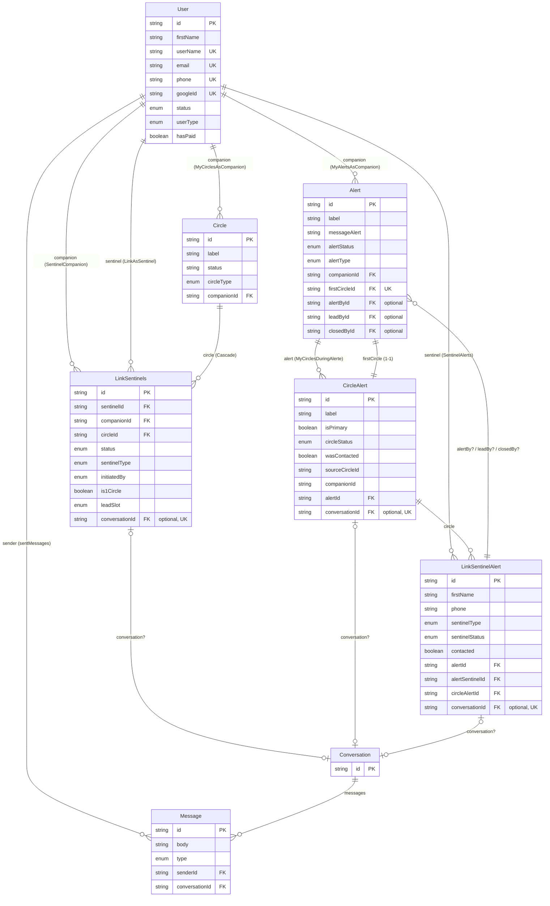
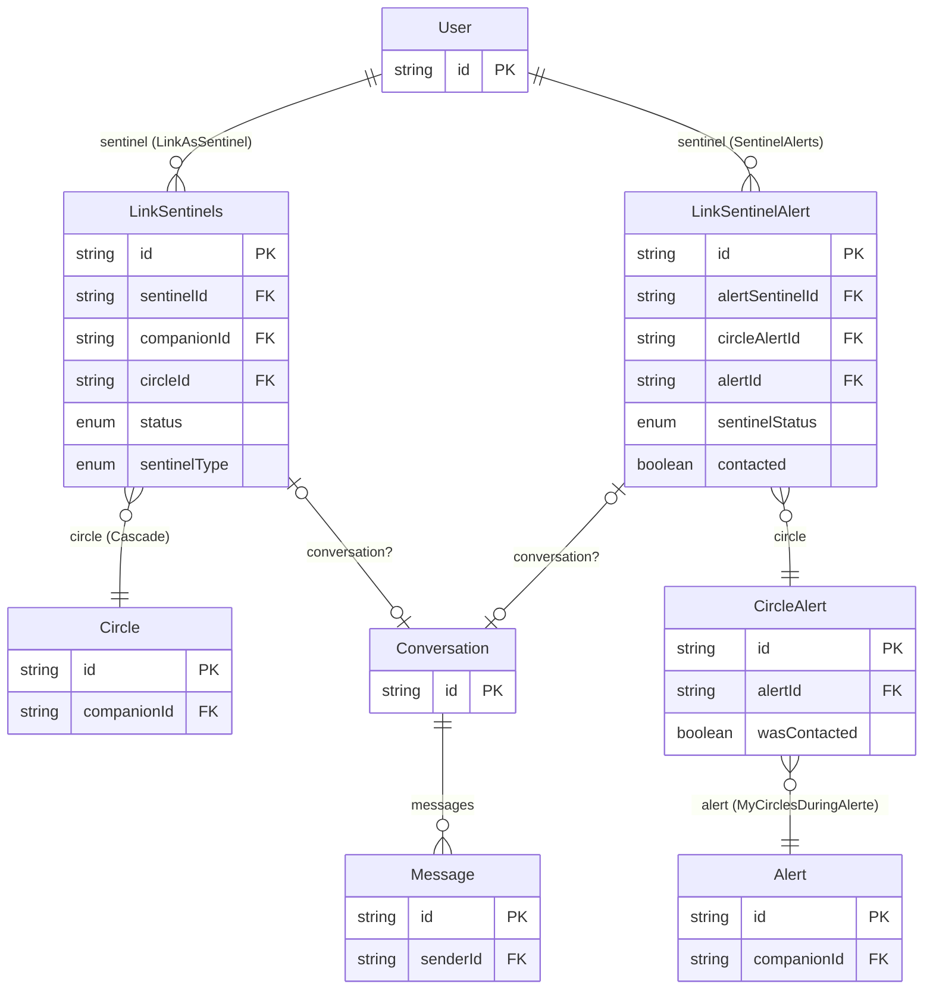
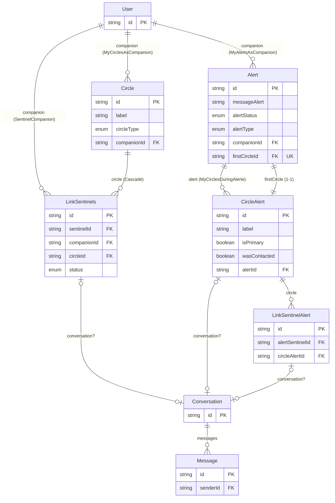
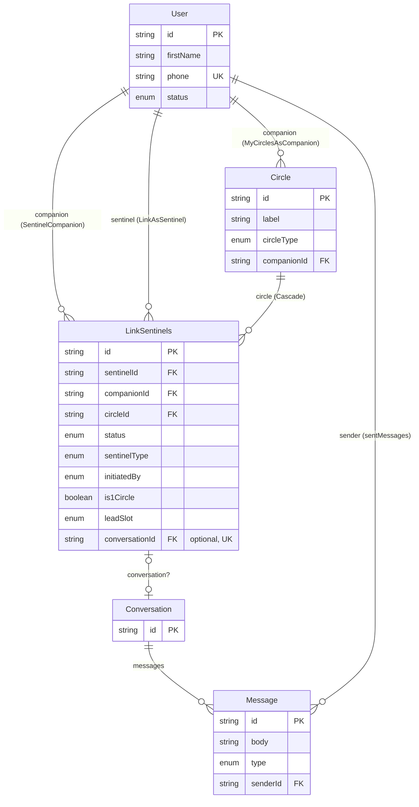
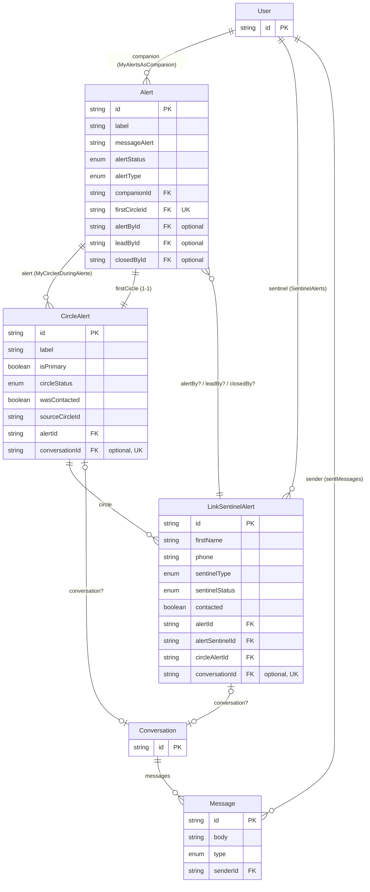

## Database Schema

> Reflète l'état actuel de `schema.prisma` (branche `data_base_definition`).

Modèles actifs : `User`, `Circle`, `Alert`, `LinkSentinels`, `CircleAlert`, `LinkSentinelAlert`, `Conversation`, `Message`.
Organization et tout ce qui en dépend sont encore en commentaire dans le fichier, pas dans la DB.

---

## Vue "Sentinel"

Ce que `User` touche quand il agit **comme sentinelle** (surveillé/protégé par personne, mais protège/veille sur d'autres) : ses liens vers des cercles qu'il ne possède pas, son historique dans les alertes des autres, et les fils de discussion qui en découlent.

- `LinkAsSentinel` : les cercles où ce `User` est enregistré comme sentinelle (`LinkSentinels.sentinelId`).
- `SentinelAlerts` : l'historique figé (`LinkSentinelAlert`) de toutes les alertes où ce `User` a été sollicité comme sentinelle. Pour remonter jusqu'à l'`Alert`, il faut passer par `CircleAlert` (deux sauts).

## Vue "Companion"

Ce que `User` touche quand il agit **comme companion** (celui qui est protégé, propriétaire de ses cercles et de ses alertes).

- `MyCirclesAsCompanion` : les cercles que ce `User` possède (`Circle.companionId`).
- `MyAlertsAsCompanion` : les alertes que ce `User` a déclenchées (`Alert.companionId`).
- Chaque `Circle` possédé expose ses `sentinelLinks` — qui a été invité/accepté dedans, avec quel statut.
- Chaque `Alert` déclenchée expose ses `myCircles: CircleAlert[]` — la photo figée de tous les cercles au moment du déclenchement, plus `firstCircle: CircleAlert` — celui d'entre eux désigné comme premier cercle sollicité. Chaque `CircleAlert` expose à son tour ses `sentinels: LinkSentinelAlert[]`.

---

## Légende — les différents types de liens

- **`LinkSentinels`** : lien *vivant* User↔Circle (qui est sentinelle, dans quel cercle, avec quel statut). Modifiable tant que le lien existe.
- **`CircleAlert`** : *copie figée* d'un `Circle` au moment où une alerte se déclenche — garde son propre historique (contacté, statut...) indépendamment du cercle vivant, qui peut changer ou disparaître après coup.
- **`LinkSentinelAlert`** : *copie figée* d'un `LinkSentinels` au moment de l'alerte — qui était sentinelle, avec ses infos copiées telles quelles (nom, téléphone...), indépendante du lien vivant pour ne jamais être faussée si celui-ci change après l'alerte.
- **`Conversation` / `Message`** : fil de discussion générique et réutilisé, rattaché (via un `conversationId` optionnel et unique) à l'un de ces trois parents : `LinkSentinels` (1:1 Me↔Sentinel hors alerte), `CircleAlert` (groupe du 1er cercle pendant l'alerte, si `isPrimary`), ou `LinkSentinelAlert` (chat isolé sentinel↔1er cercle pendant l'alerte). Un seul modèle pour les 3 contextes — pas de `type` stocké, le parent qui porte le `conversationId` fait foi.

---

## Schéma "avant alerte"

Le monde vivant, tel qu'il existe tant qu'aucune alerte n'est déclenchée : cercles, liens sentinelles, et la messagerie 1:1 Me↔Sentinel qui va avec.

Rien ici n'est jamais supprimé "en vrac" au déclenchement d'une alerte : c'est justement pour que ces données puissent continuer à changer librement (le lien peut être modifié, la sentinelle peut partir) que tout ce qui suit est une *copie figée*, pas une référence directe.

## Schéma "pendant alerte"

Ce qui se déclenche et existe une fois une alerte lancée : la photo figée des cercles/sentinelles au moment T, plus les chats scopés à cette alerte.

`alertById`/`leadById`/`closedById` pointent vers `LinkSentinelAlert` (pas `User`) et sont tous optionnels — `alertType = BYCOMPANION` (le/la companion s'auto-alerte) n'a pas de sentinelle déclenchante, donc `alertById` reste `null` dans ce cas.
