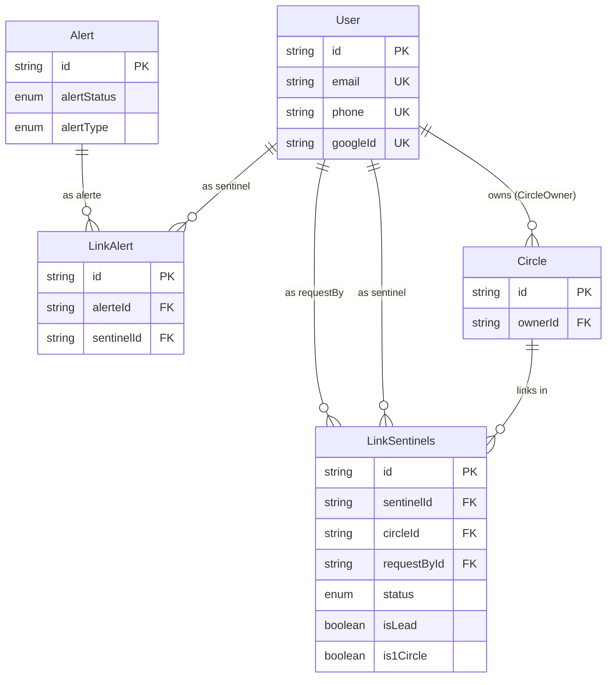

## Database Schema

> État repris de `schema.prisma` actif (`User`, `Circle`, `Alert`, `LinkSentinels`,
> `LinkAlert`). Ce fichier documente l'état **réel** du code, y compris ses
> incohérences actuelles (voir "Notes / TBD" en bas) — `schema.prisma` est en
> plein remaniement et ne compile probablement pas tel quel.

## Principe : le many-to-many

Un champ FK ne pointe que vers une seule table. Pour lier deux entités en
"plusieurs vers plusieurs", on passe toujours par une **table de liaison**
avec une FK vers chaque côté (+ ses propres champs si besoin). Dans ce
schéma : `LinkSentinels` (User ↔ Circle) et `LinkAlert` (User ↔ Alert).

Quand la même table est référencée plusieurs fois depuis la table de
liaison (ex: `LinkSentinels` a plusieurs FK vers `User` : sentinel/
requestBy, et un `companion` prévu mais commenté), chaque relation doit
être **nommée** en Prisma (`@relation("NomChoisi")`) pour lever
l'ambiguïté — **et ce nom doit être identique des deux côtés de la
relation**, sinon Prisma ne peut pas les apparier (voir Notes/TBD).

## `LinkSentinels` vs `LinkAlert`

- **`LinkSentinels`** = état **vivant**, modifiable : qui est sentinel de
  qui, dans quel circle, avec quel rôle (`status`, `isLead`, `is1Circle`).
- **`LinkAlert`** = lien entre une `Alert` et un `User` (sentinel) — pensé à
  l'origine comme une **copie figée** au moment de l'alerte (voir version
  précédente de ce doc : `userId`, `circleId`, rôle, statut de
  notification), mais le modèle actuel dans le code a été réduit à
  `alerteId` + `sentinelId` seulement. Les champs de snapshot (`circleId`,
  `isLead`, `notificationStatus`) ne sont plus dans le code — à
  réintroduire ou à confirmer que c'est volontaire.
- Le `companion` (cible de l'alerte) était prévu comme FK directe sur
  `Alert` (cardinalité 1, pas besoin de table de liaison) — dans le code
  actuel, `companionId` sur `Alert` est mal typé (voir Notes/TBD).

## Légende

**Cardinalité** (notation patte d'oie) :

| Symbole | Signification |
|---------|---------------|
| `\|\|` | exactement un |
| `o\|` | zéro ou un |
| `}o` | zéro ou plusieurs |
| `}\|` | un ou plusieurs |

**Marqueurs de champs** :

| Marqueur | Signification |
|----------|---------------|
| `PK` | Primary Key — identifiant unique de la ligne |
| `FK` | Foreign Key — pointe vers le PK d'une autre table |
| `UK` | Unique Key — valeur unique dans la table |

## Notes / TBD (incohérences actuelles dans `schema.prisma`)

- **`Alert.companionId` / `sentBy` / `leadBy` / `closedBy`** sont typés
  directement `User` (ou `User?`) sans champ scalaire FK ni
  `@relation(fields: [...], references: [...])`. Il manque les colonnes
  `companionId String`, `sentById String`, etc. + les relations nommées
  associées. Tel quel, ces champs ne sont pas des FK valides.
- **`User.linksToSentinels`** (`@relation("LinksToSentinels")`) et
  **`LinkSentinels.sentinel`** (`@relation("LinkstoSentinels")`) — nom de
  relation différent (casse : `LinksTo` vs `Linksto`). Prisma ne les
  reconnaîtra pas comme la même relation.
- **`User.linksToCompanions`** (`@relation("LinksToCompanions")`) n'a
  aucune contrepartie : le champ `companion` sur `LinkSentinels` est
  commenté (`//    companion User @relation("CompanionLinks", ...)`).
  Relation actuellement orpheline.
- **`User.leadSentinel`** (type `LinkSentinels`, singulier, non optionnel)
  et **`User.firstCircle`** (type `Circle`, singulier, non optionnel)
  n'ont pas de FK scalaire ni de contrepartie côté `LinkSentinels`/`Circle`
  — à clarifier (probablement voulu comme champs calculés côté
  application plutôt que relations Prisma directes).
- **`User.currentAlert` / `alertHistory`** et **`LinkSentinels.CurrentAlert`
  / `HistoryAlert`** se recoupent avec le rôle de `LinkAlert` — doublon déjà
  noté dans la version précédente de ce doc, toujours pas tranché.
- **`LinkAlert`** a perdu `circleId`, `isLead`, `notificationStatus` par
  rapport à la version précédente de ce doc — à confirmer si c'est
  volontaire (simplification) ou temporaire (WIP).
- Globalement, `schema.prisma` semble être un instantané en cours d'édition
  (plusieurs relations désappariées) — probablement à ne pas lancer
  `prisma generate`/`migrate` tant que ces points ne sont pas réglés.
