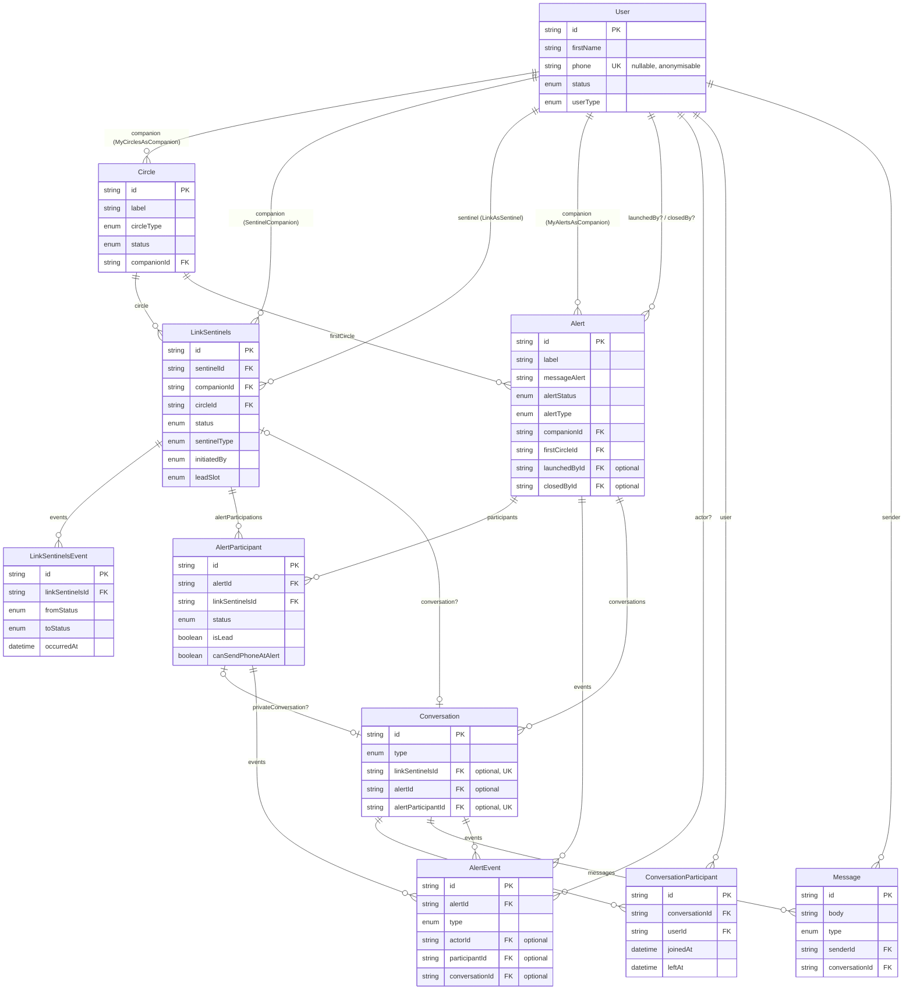
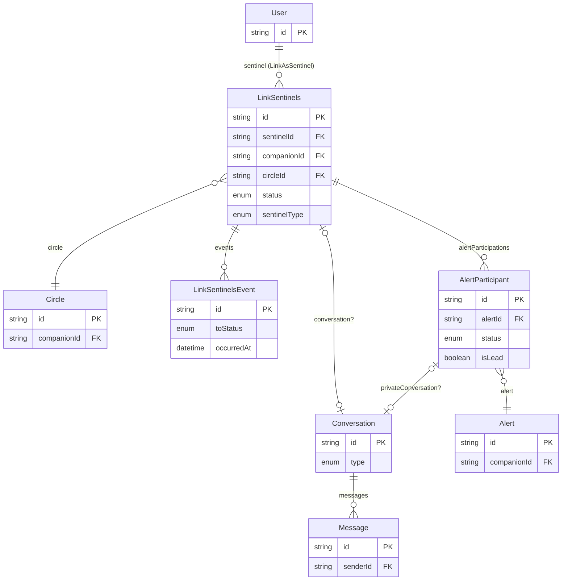
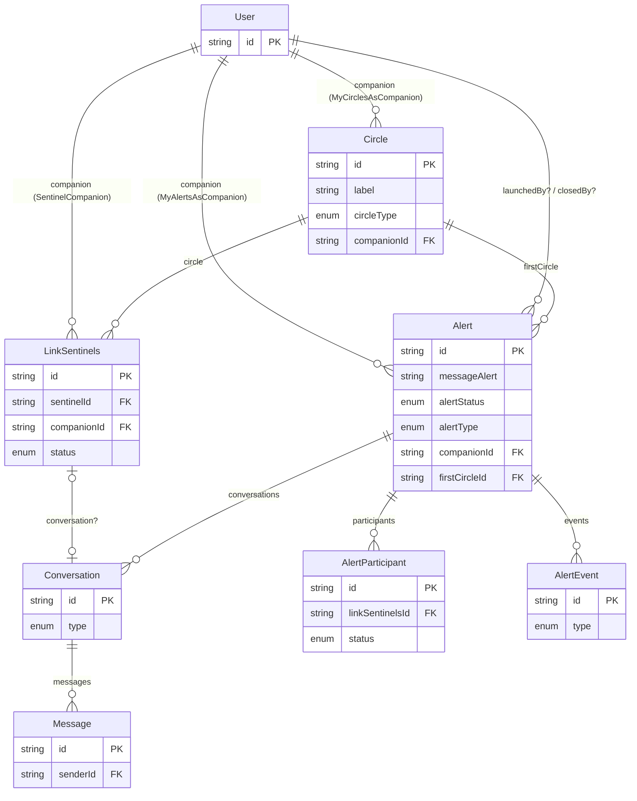
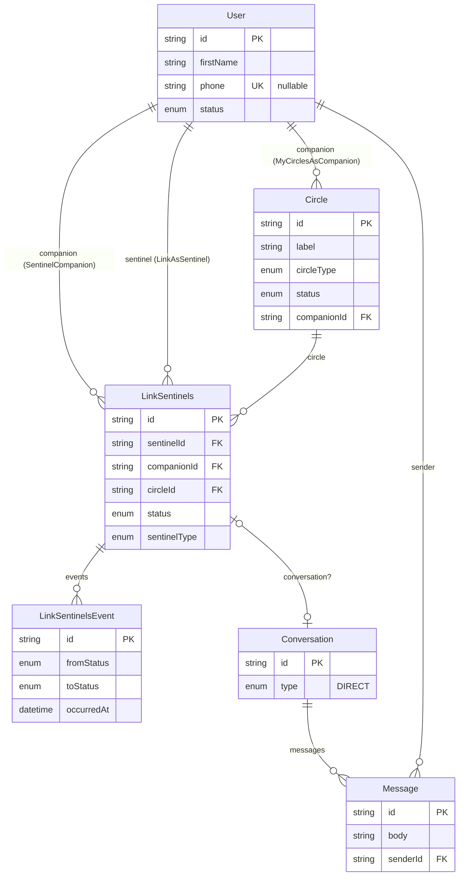
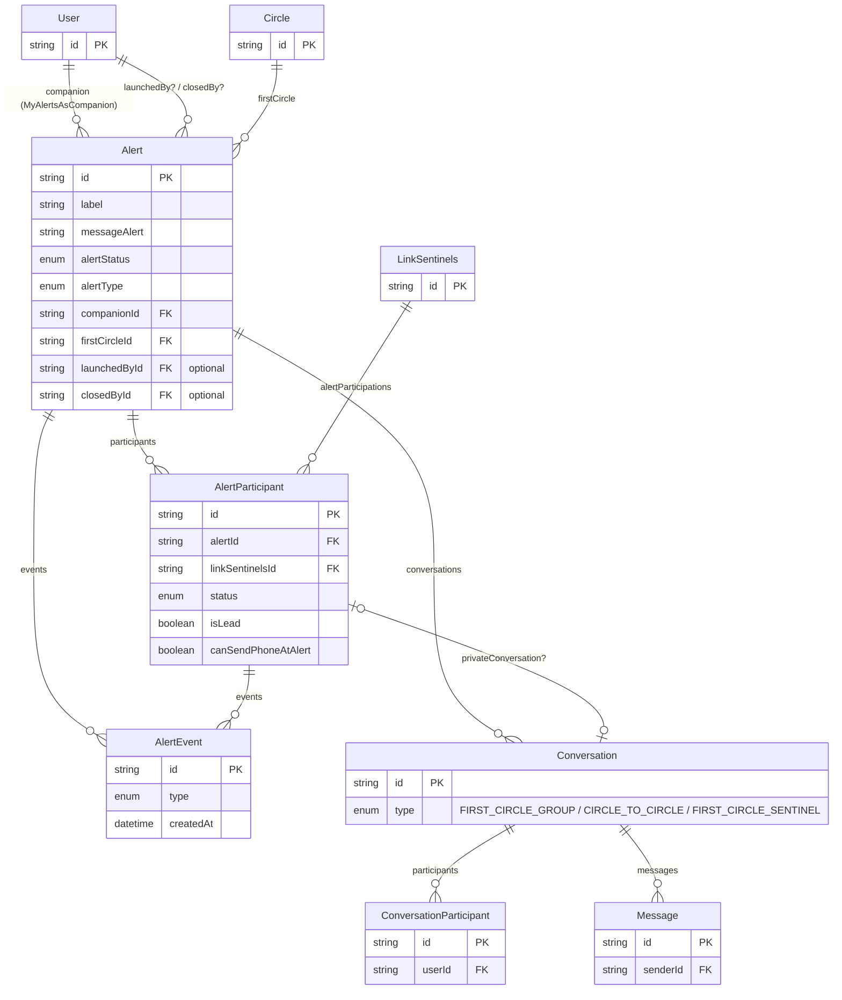

## Database Schema

> Reflète l'état actuel de `schema.prisma` (branche `data_base_definition`).

Modèles actifs : `User`, `Circle`, `LinkSentinels`, `LinkSentinelsEvent`, `Alert`, `AlertParticipant`, `AlertEvent`, `Conversation`, `ConversationParticipant`, `Message`.
Principe central : rien n'est jamais vraiment supprimé — `User`/`Circle`/`LinkSentinels` se ferment ou s'anonymisent, mais restent référençables pour toujours. Plus de tables-copies (`CircleAlert`/`LinkSentinelAlert` ont disparu).

---

## Vue "Sentinel"

Ce que `User` touche quand il agit **comme sentinelle**.

- `LinkAsSentinel` : les cercles où ce `User` est enregistré comme sentinelle.
- `alertParticipations` : l'historique de toutes les alertes où ce `User` a été sollicité — via son `LinkSentinels`, sans copier son identité.

## Vue "Companion"

Ce que `User` touche quand il agit **comme companion**.

- `MyCirclesAsCompanion` : les cercles que ce `User` possède.
- `MyAlertsAsCompanion` : les alertes que ce `User` a déclenchées.
- `firstCircle` sur `Alert` pointe directement sur `Circle` (permanent) — plus besoin de snapshot.

---

## Schéma "avant alerte"

Le monde vivant : cercles, liens sentinelles (jamais fermés/recréés, juste transitionnés), leur journal minimal, et la messagerie 1:1 permanente.

Chaque transition de statut (`PENDING→ACCEPTED`, `ACCEPTED→REMOVED`...) crée une ligne `LinkSentinelsEvent` — c'est la seule trace d'historique hors alerte, et elle sert aussi de déclencheur de notification ("Anna a quitté ton 1er cercle").

## Schéma "pendant alerte"

Ce qui se déclenche une fois une alerte lancée : qui a participé (référence directe au lien permanent, pas de copie), la timeline, et les chats scopés à l'alerte.

`AlertParticipant.linkSentinelsId` est obligatoire — il pointe toujours sur le lien vivant, jamais une copie. Le cas "companion s'auto-alerte" (`AlertType.BYCOMPANION`) n'a pas besoin de `AlertParticipant` : `Alert.launchedBy` pointe directement sur `User`.

---

## Légende — les différents mécanismes d'historique

- **`LinkSentinels`** : lien vivant User↔Circle, une seule ligne par paire, jamais supprimée — juste son `status` change (`PENDING`/`ACCEPTED`/`REMOVED`/`BLOCKED`...).
- **`LinkSentinelsEvent`** : journal append-only de chaque transition de statut — trace minimale de qui est entré/sorti d'un cercle, indépendamment de toute alerte.
- **`AlertParticipant`** : ce qui s'est passé pour un `LinkSentinels` donné pendant une alerte donnée (contacté, répondu, lead, réglages de messagerie au moment T) — remplace l'ancien `LinkSentinelAlert`, sans jamais copier l'identité (nom/téléphone restent uniquement dans `User`).
- **`AlertEvent`** : timeline chronologique de l'alerte elle-même (lancement, contact, réponse, lead assigné, changement de statut, clôture...), typée (`AlertEventType`) et distincte des messages.
- **`Conversation` / `ConversationParticipant` / `Message`** : fil générique et réutilisé pour les 4 types (`ConversationType`) :
  - `DIRECT` : companion ↔ un sentinel, permanent, toujours exactement 2 participants (jamais de groupe, pour protéger la personne) — ancré via `LinkSentinels.conversation` (1-1).
  - `FIRST_CIRCLE_GROUP` : le groupe du 1er cercle pendant une alerte.
  - `CIRCLE_TO_CIRCLE` : le 1er cercle interroge un autre cercle.
  - `FIRST_CIRCLE_SENTINEL` : chat isolé entre le 1er cercle et une sentinelle active — ancré via `AlertParticipant.privateConversation` (1-1).

Anonymisation : quand un `User` supprime son compte, `status → DELETED` + ses champs identifiants sont vidés/anonymisés, mais son `id` reste — `Message.senderId`, `AlertParticipant`, `ConversationParticipant` continuent de fonctionner sans casser l'historique.
